 

Faço interfaces em **React** e **Vue/Nuxt** com **TypeScript**, e cuido do back quando o projeto pede: login, banco e APIs. Hoje sou estagiário de desenvolvimento na **SEAC-PA**, no Governo do Pará, e curso Ciência da Computação na FACI-Wyden.

### Trabalhos selecionados

  
  
  
  

  Demos ao vivo:
  <a href="https://calendario-municipal.vercel.app">Calendário</a> ·
  <a href="https://caresyncv2.vercel.app">CareSync</a> ·
  <a href="https://apexgym-one.vercel.app">Apex Gym</a>
  &nbsp;&nbsp;|&nbsp;&nbsp;
  Mais:
  <a href="https://github.com/thivgo/LTD-Descarte-Aqui.">Descarte Aqui</a> ·
  <a href="https://github.com/thivgo/fullroleplay">Full Roleplay</a> ·
  <a href="https://github.com/thivgo/management-discord-bot">Management Bot</a> ·
  <a href="https://github.com/thivgo/anotherportfolio">Portfólio</a>

  

  <a href="mailto:thiago.mauess@gmail.com">E-mail</a> ·
  <a href="https://www.linkedin.com/in/thiagomvues">LinkedIn</a> ·
  <a href="https://anotherportfolio-taupe.vercel.app">Portfólio</a>

